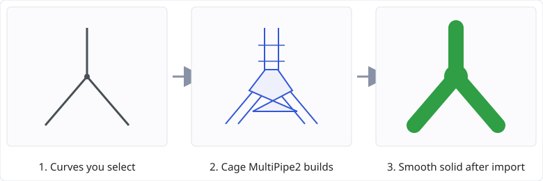
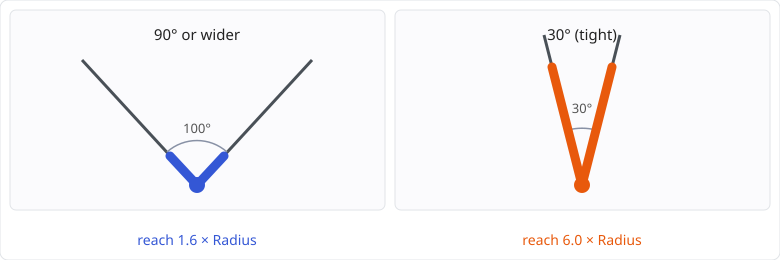
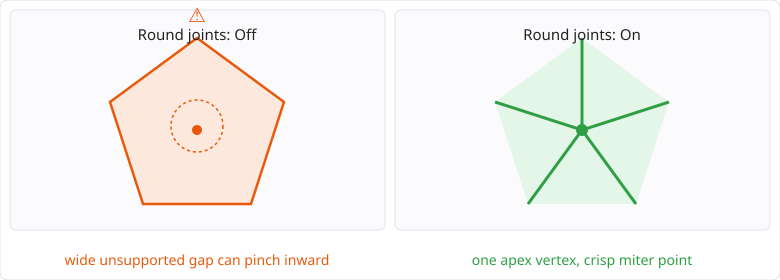

# MultiPipe2

### Turn a network of curves into one smooth pipe frame, inside MoI, in a single step.

> [!NOTE]
> Unofficial. Not affiliated with, endorsed by, or supported by Triple Squid Software (MoI) or
> Robert McNeel & Associates (Rhino). Both are trademarks of their owners, named here only to say
> what this script does and how it compares to a similar built-in Rhino command. You need your own
> licensed copy of MoI to run it.

Select any set of curves and run `MultiPipe2`. It builds a coarse **cage** around them — square
rings along every strut, a joint at every node — and lets MoI's own SubD import subdivide that
cage into one smooth solid. No union, no fillet, nothing that can fail partway through.

---

## See it in action

### MultiPipe2 1.1.7

https://github.com/user-attachments/assets/e1a72808-9ef2-41f1-998f-270c2b541f39

### Earlier version

https://github.com/user-attachments/assets/071b6773-6232-4697-a9c9-91e274a16de6

---

## Contents

- [See it in action](#see-it-in-action)
- [What it does](#what-it-does)
- [Options](#options)
- [Tight angles grow the joint](#tight-angles-grow-the-joint)
- [Round joints: fixing the pinch at grown nodes](#round-joints-fixing-the-pinch-at-grown-nodes)
- [How it compares to Rhino's MultiPipe](#how-it-compares-to-rhinos-multipipe)
- [Known limits](#known-limits)
- [Install](#install)
- [Version history](#version-history) · [Thanks](#thanks)
- [Full manual, license and built-with](#full-manual-license-and-built-with)

---

## What it does

- **Smooth joints everywhere**, at any number of struts per node. Tight angles grow fuller joints
  automatically, and the summary says how many grew and by how much.
- **Lines, polylines and smooth curves.** Polyline corners are nodes; closed curves become closed
  tubes. Duplicate curves are dropped and counted; crossings are warned about and left unjoined.
- **One pipe frame per connected group of curves**, each a closed solid — or an open surface with
  *Cap* off.
- **Nothing is kept until you press Done.** The command changes none of MoI's settings, and one
  <kbd>Ctrl</kbd>+<kbd>Z</kbd> takes the whole result back.

---

## Options

| Option | Default | What it does |
|---|---|---|
| Radius | 0.5 | Strut radius, as a distance in your document units. When the selected curves are all on one style, this is the only radius input and applies to every strut. When they span two or more styles, one radius input appears per style instead, named after it, so each curve builds its own thickness. Every Radius field has a Pick button that sets the radius by pointing in the viewport, with a guide circle. The options step always shows a Preview in the viewport. |
| Node size | 1.6 | How far a joint reaches along each strut, as a multiple of the radius. Where struts of different radii meet, it is a multiple of the largest radius at that node, shared by all of them. Minimum 1.0; tight angles grow it further. |
| Divisions | Auto | *Auto* divides curved struts just enough to follow the curve. Off: every strut gets the whole number you type. |
| Cap | On | Rounds off free ends, so the result is a closed solid. Off leaves them open. |
| Round joints | Off | Holds grown joints round instead of letting them pinch — see [below](#round-joints-fixing-the-pinch-at-grown-nodes). |
| All nodes | Off | With *Round joints* on, applies it to every node, not only the ones that grew. |

---

## Tight angles grow the joint

A joint that only reached *Node size* along each strut would fold through itself where struts meet
at a sharp angle. MultiPipe2 grows that node's joint automatically, just far enough to stay clean —
the tighter the angle, the fuller the joint — and the summary reports how many nodes grew and the
largest reach.

---

## Round joints: fixing the pinch at grown nodes

A grown joint is the convex hull of every incident strut's ring. At a heavily grown or high-degree
node that hull can span a wide, unsupported gap around the node's true point, and MoI's SubD import
pulls the smooth surface into that gap — a visible pinch, worst at hubs with several struts.

Turning **Round joints** on replaces that flat hull, for every qualifying node, with an **apex-vertex
fan**: one new vertex at the node's own point, with each strut's joint ring connected to it directly.
The result reads as a crisp, symmetric miter point instead of a pinch. Where the geometry does not
allow it safely, MultiPipe2 falls back to the flat hull for that node only, unchanged.

---

## How it compares to Rhino's MultiPipe

Rhino has shipped its own native `MultiPipe` command since Rhino 7 — same core idea: pick curves,
build a SubD pipe frame with smooth joints at the intersections. It is the closest existing
reference point, and the honest comparison is against Rhino's own documentation, not marketing:

| | MultiPipe2 (this script, for MoI) | Rhino's `MultiPipe` ([official docs](https://docs.mcneel.com/rhino/8/help/en-us/commands/multipipe.htm)) |
|---|---|---|
| Application | MoI3D, any version with SubD import | Rhino 7 or newer (native command and Grasshopper component) |
| Cost to add | Free script, no install beyond copying files | Included with a Rhino 7+ license |
| Documented options | Radius (one per style), Node size, Divisions (Auto or manual per strut), Cap, Round joints, All nodes | Radius, Cap, Struts (a single division count) |
| Per-node joint size | Yes — *Node size*, and grown automatically at tight angles | Not documented |
| Reported diagnostics | Grown nodes and largest reach, duplicate curves dropped, crossings left unjoined, short struts, free ends | Not documented |
| Pinch control at grown/high-degree joints | Yes — *Round joints* / *All nodes*, see above | Not documented |
| Runtime dependency | None — plain script files MoI already knows how to run | Built into Rhino |

Where the table says "not documented," that means Rhino's own reference page does not describe the
behaviour either way — not that Rhino lacks it. If you use Rhino's `MultiPipe` and know it does (or
doesn't) do one of these, an issue with a link to where it's documented is welcome.

The one thing this comparison **can't** tell you is which result looks better on your model — they
run different subdivision and joint-building code, and the only real test is building the same
frame in both.

---

## Known limits

- The radius and rounded free ends are approximate (within about 1.5%, ends finish about
  0.08 × radius short).
- Crossings are not split for you.
- A pipe frame of 300 struts takes about 18 seconds — nearly all of it MoI's own SubD import.
- The struts are solid, not hollow.
- A radius is per curve, not per point: a strut is one radius end to end, with no taper between struts of
  different radii. At most eight styles can be mixed in one run.
- A thin strut meeting a fat one runs straight for longer before its first ring, because the joint at that node
  is sized by the largest radius meeting there. For the same reason, making one curve thicker can push a short
  strut at a tight angle past what its joint can build.

The [manual](MultiPipe2-manual.html) documents every option, every message, and the full list.

---

## Install

Copy `MultiPipe2.js`, `MultiPipe2.htm` and `MultiPipe2Planner.js` into your MoI commands folder
(`%APPDATA%\Moi\commands\` on Windows), restart MoI, and type `MultiPipe2` on the command line.
Full steps, a shortcut-key tip and troubleshooting are in the manual.

---

## Version history

Every version is a zip under `dist/` in this repository; releases are also on the
[Releases page](https://github.com/preluceo-tools/scripts-for-moi/releases).

| Version | What changed |
|---|---|
| **1.1.7** | Preview always says why it falls back to a lighter preview, and never leaves a stray object in the scene. |
| 1.1.6 | Pipe frame Preview shows the real SubD pipe frame for networks up to 200 cage faces. |
| 1.1.5 | Preview appears as soon as the options open, for every selection; Pick works on the single Radius field too; heavy scenes fall back to a lighter preview. Failed joints select only the failed curves, not the built result. Each Pick button sits under its radius input. |
| 1.1.4 | Pick button next to each Radius field sets the radius in the viewport, with a guide circle; Cage curves preview, as suggested by MO (MO_TE). |
| 1.1.3 | One Radius field per style, placed in the options panel, with the manual and README using one term for it. |
| 1.1.2 | Per-style Radius rows show up reliably in the options panel. |
| 1.1.1 | Per-curve radius, carried by each curve's style. Output option: pipe frame, cage curves, cage surfaces or cage solid. Partial build when some joints fail, with the failed curves selected. Back button from the summary to the options. Suggested by MO (MO_TE) — see [Thanks](#thanks). |
| 1.0.0 | First release: smooth pipe frame from lines, polylines and curves, closed rings, tight-angle node growth, round joints, cap-off, manual or automatic divisions, large frames. |

### Thanks

Thanks to **MO (MO_TE)** for revising and testing MultiPipe2 on a network of more than 100 curves,
and for the suggestions in the [MoI forum thread](https://moi3d.com/forum/index.php?webtag=MOI&msg=12116.4) that shaped 1.1.1 and 1.1.4:

- a radius per pipe instead of one radius for all;
- an option to output the cage itself, to edit it and SubD-import it by hand or by script, and a raw
  cage preview that skips the SubD import;
- showing failed joints by selecting their curves in the viewport, instead of filling the panel with
  coordinates;
- a Back button, for trial and error without cancelling and running the command again.

---

## Full manual, license and built-with

The [manual](MultiPipe2-manual.html) covers installing, every option, every message and error, tight
angles and round joints in full, known limits, what's tested and what isn't, the **Built with**
table of everything the script depends on, and the license (GPL v3 for the code, CC BY 4.0 for the
docs). This page is the short version; the manual is the reference.
